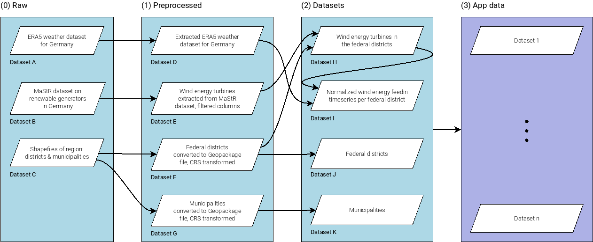

# Data pipeline

## Data flow

This section describes the data flow of the pipeline.

(RAW) -> (PREPROCESSED) -> (DATASETS) -> (APPDATA)

Overview:

| **Step** | **Directory**         | **Description**                           | **Rule(s) for this target** | **Cfg section** |
|:--------:|-----------------------|-------------------------------------------|-----------------------------|-----------------|
|    0     | `store/raw/`          | Raw data as downloaded                    | TBD                         | TBD             |
|    1     | `store/preprocessed/` | Preprocessed data, 1:1 from (0)           | TBD                         | TBD             |
|    2     | `store/datasets/`     | Datasets, n:1 from (0) and (1)            | TBD                         | TBD             |
|    3     | `store/appdata/`      | Data ready to be used in the app from (2) | TBD                         | TBD             |

In the following each step is shortly described along a common example use
case.

**Example data flow:**

**Snakefile**

- As all rules will be
  searched for and included in the main [Snakefile](../workflow/Snakefile),
  they must have unique names. It's a good idea to use the dataset name as
  prefix, e.g. `rule osm_forest_<RULE_NAME>`.

### (0) Raw

Contains immutable raw data as downloaded. In directory `.TEMPLATE` there are
two additional files: [dataset.md](raw/.TEMPLATE/dataset.md) (see that file
for further  instructions) and [metadata.json)](raw/.TEMPLATE/metadata.json).

Note: Assumptions are to be defined in the scenarios, not the raw data.
See the scenario readme in [SCENARIOS.md](../scenarios/SCENARIOS.md).

> **Example:**
> - Dataset A: ERA5 weather dataset for Germany
> - Dataset B: MaStR dataset on renewable generators
> - Dataset C: Shapefiles of region: federal districts and municipalities

### (1) Preprocessed

Data from `(0) Raw` that has undergone some preprocessing such as:
 - Archive extracted
 - CRS transformed (see below for CRS conventions)
 - Fields filtered
 - **But NO merging/combining/clipping of multiple (raw) datasets! This should
   be done in (2)**

Rules, config and info
- Preprocessing rule(s) for the dataset can be defined in the dataset's
  Snakefile: [preprocessed/.TEMPLATE/create.smk](preprocessed/.TEMPLATE/create.smk).
- Subsequently, these rules **must be** included in the module file
  [preprocessed/module.smk](preprocessed/module.smk) to take effect (see
  template in the file).
- Custom, dataset-specific configuration can be put into the dataset's config
  file [preprocessed/.TEMPLATE/config.yml](preprocessed/.TEMPLATE/config.yml).
- The title and description of each dataset are to be gathered in the file
  [preprocessed/.TEMPLATE/dataset.md](preprocessed/.TEMPLATE/dataset.md).

> **Example:**
> - Dataset D: Extracted ERA5 weather dataset for Germany (from dataset A)
> - Dataset E: Wind energy turbines extracted from MaStR dataset, filter for
>   columns power and geometry (from dataset B)
> - Dataset F: Federal districts converted to Geopackage file, CRS transformed
>   (from dataset C)
> - Dataset G: Municipalities converted to Geopackage file, CRS transformed
>   (from dataset C)

### (2) Datasets

Datasets, created from arbitrary combinations of datasets from
`store/preprocessed/` and/or `store/datasets/`.

Rules, config and info
- Creation rule(s) for the dataset can be defined in the dataset's
  Snakefile: [datasets/.TEMPLATE/create.smk](datasets/.TEMPLATE/create.smk).
- Subsequently, these rules **must be** included in the module file
  [datasets/module.smk](datasets/module.smk) to take effect (see
  template in the file).
- Custom, dataset-specific configuration can be put into the dataset's config
  file [datasets/.TEMPLATE/config.yml](datasets/.TEMPLATE/config.yml).
- The title and description of each dataset are to be gathered in the file
  [datasets/.TEMPLATE/dataset.md](datasets/.TEMPLATE/dataset.md).
- Custom, dataset-specific scripts are located in `scripts`.

> **Example:**
> 
> Using datasets from `store/preprocessed/` and `store/datasets/`:
> - Dataset H: Wind energy turbines in the region of interest (from datasets E+F)
> - Dataset I: Normalized wind energy feedin timeseries for the region (from
>   datasets D+G)
> - Dataset J: Federal districts (from dataset F)
> - Dataset K: Municipalities (from dataset G)

### (3) App data

**TBD**

Data ready to be used in the app / as expected by the app.

While `store/datasets/` may contain datasets from intermediate steps (see
below), this directory holds app-ready datasets only.

### To which processing step do the different stages of my data belong to?

Often, there are multiple options to assign a dataset. If you're still unsure
where the different stages of your dataset should be located after having
read the examples above, the following example may help you:

Let's say you want to integrate some subsets of an OpenStreetMap dataset,
namely extracting (a) forests and (b) residential structures for a specific
region. You want both be stored in separate files. This involves (e.g.):
1. Convert the pbf file to a more handy type such as Geopackage
2. Extract data using OSM tags
3. Clip with region

First, you would create a new raw dataset in `store/raw/`. Then, you could
either put steps 1 and 2 in the preprocessing, resulting in two datasets in
`store/preprocessed/`. For each, you could then perform step 3 in
`store/datasets/`.
However, this would imply a redundant execution of step 1. While this is
basically fine in the terms of the pipeline flow, it might be a better idea to
apply only step 1 and create one dataset in `store/preprocessed/`. Using this
dataset, you would create the two extracts in `store/datasets/`. Finally, the
datasets after performing step 3 would be created in `store/datasets/` as well
resulting in a total of four datasets in `store/datasets/`.

### Temporary files

**TODO: REVISE**

Temporary files are stored in `store/temp/` by default and, depending on your
configuration, can get quite large.  You can change the directory in
`config.yml` -> `path` -> `temp`.

## Further notes

### No data files in the repository! But keep the `.gitkeep` files

Make sure **not to commit any data files** located in `store/` to the
repository (except for the descriptive readme and metadata files). Rules have
been defined in the `.gitignore` file which should make git omit those
files but you better don't count on it. Instead, save them in the designated
directory on the [RLI Wolke](https://wolke.rl-institut.de/f/160572).

Each data directory in the provided templates contain an empty `.gitkeep`
file. When creating a new dataset, please commit this file too to make sure
the (empty) data directory is retained. 

### Coordinate reference system

Please use LAEA Europe (EPSG:3035) as default CRS when writing geodata.

**TODO: REVISE**

- The files in `store/raw/` can have an arbitrary CRS.
- In the preprocessing (step 1) it is converted to the CRS specified in the global `config.yml` -> `preprocessing` -> 
  `crs`. It is important to use a equal-area CRS to make sure operations such as buffering work properly. By default,
  it is set to LAEA Europe (EPSG:3035).
- The final output is written in CRS specified in the global `config.yml` -> `output` -> `crs`. By default, it is set
  to WGS84 (EPSG:4326) used by the app.

## HowTos

### Add a new dataset

**TBD**
