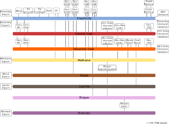

# Energiesystem

Im Folgenden wird der Aufbau des in Digiplan verwendeten Energiesystems für die
Region Anhalt-Bitterfeld-Wittenberg beschrieben. Die Generierung der
Energiesystemdaten für die App ist Teil der
[Developer Docs](../sections/esys_dev.md).

## Das Energiesystem im Überblick

Schematische Darstellung:

In den Modellen wird das Energiesystem für das Jahr 2045 aufgestellt. Dabei
wird sich am derzeitigen Energiesystem orientiert, dessen Komponenten u.a. auf
den Daten des Marktstammdatenregisters (MaStR) beruhen.

## Annahmen und Vereinfachungen

Es werden die folgenden Annahmen und Vereinfachungen getroffen:

- Für die Prognosen (z.B. Energieträger, Verbräuche) werden die
  [BMWK Langfristszenarien](https://langfristszenarien.de) verwendet, vgl.
  Datensatz [BMWK Langfristszenarien](../datasets/raw_datasets.md#bmwk-langfristszenarien).
- Biomasse wird unterteilt in: feste, gasförmige und flüssige Biomasse.
- Die Vorhersage zur Entwicklung der Biomasse geschieht auf der Basis von:
  ["Technoökonomische Analyse und Transformationspfade des energetischen Biomassepotentials (TATBIO)"](https://www.bmwk.de/Redaktion/DE/Publikationen/Studien/technooekonomische-analyse-und-transformationspfade-des-energetischen-biomassepotentials.pdf?__blob=publicationFile&v=1),
  vgl. Datensatz [dbfz_biomass_heat_capacities](../datasets/raw_datasets.md#installierte-leistungen-von-biomasse-konversionstechnologien).
- Flüssige Biomasse wird im Jahr 2045 ausschließlich im Verkehrsektor
  eingesetzt.
- Der Verkehrssektor wird vernachlässigt. Demnach entfällt der Einsatz flüssiger
  Biomasse.
- Es wird kein Biogas importiert: Sämtliches Biogas wird regional durch Biomasse
  erzeugt.
- Der Bus Methan steht stellvertretend für einen Bus für klimaneutrale Gase.
  Es handelt sich um eine Mischung aus grünem Wasserstoff und Biomethan.
  Immer wenn von Methan gesprochen wird, ist diese Gasmischung gemeint.
- Der Energieträger Braunkohle ist nur relevant zur Berechnungen der Emissionen
  zum Status quo.
- Für das Jahr 2045 ist kein Import von Braunkohle vorhergesehen.
- Es wird das Jahr 2045 in stündlichen Schritten betrachtet.
- Sämtliche Zeitreihen liegen in dieser Auslösung vor oder werden in diese
  Auflösung übersetzt.
- Es handelt sich um eine Dispatch Optimierung.
- Sämtliche Kapazitäten und Energiemengen bis auf die der Importe und Exporte
  sowie die der Speichertechnologien sind fix gesetzt.
- Die Optimierung findet nach dem Perfect-Forsight-Prinzip über den
  Zeithorizont eines Jahres statt.
- Die Strombedarfe werden je Sektor (Haushalte, GHD, Industrie) aggregiert
  abgebildet, vgl. Datensatz
  [demand_electricity_region](../datasets/datasets_datasets.md#strombedarf).
- Die Wärmebedarfe werden je Sektor (Haushalte, GHD, Industrie) abgebildet,
  unterteilt in zentral (Fernwärmenetze) und dezentral, vgl. Datensatz
  [demand_heat_region](../datasets/datasets_datasets.md#wärmebedarf).
- Es erfolgt keine Modellierung der Strom- und Wärmenetze.

## Das Energiesystem im Detail

### Busse

Die folgenden acht Energieträger sind die Busse im Energiesystem:

- Elektrizität
- Zentrale Wärme
- Dezentrale Wärme
- Methan
- Holz
- Braunkohle
- Biomassse
- Biogas

### Erzeugungstechnologien

Volatile Erzeugungsanlagen werden mit der
[oemof.tabular Komponente volatile](https://github.com/oemof/oemof-tabular/blob/dev/src/oemof/tabular/facades/volatile.py)
abgebildet. Die folgenden Erzeugungsanlagen werden im Energiesystem betrachtet:

| Komponente                   | Energieträger input | Energieträger output | Beschreibung            | Komponentenname
|------------------------------|---------------------|----------------------|-------------------------|----------------------------------
| Wind                         |                     | Elektrizität         | Onshore-Wind            | wind-onshore
| PV (ground)                  |                     | Elektrizität         | Freiflächen-PV          | solar-pv_ground
| PV (rooftop)                 |                     | Elektrizität         | Aufdach-PV              | solar-pv_rooftop
| Cen. Solar thermal collector |                     | Elektrizität         | Zentrale Solarthermie   | solar-thermalcollector_central
| Dec. Solar thermal collector |                     | Elektrizität         | Dezentrale Solarthermie | solar-thermalcollector_decentral
| RoR                          |                     | Elektrizität         | Laufwasserkraftwerk     | hydro-ror

### Import und Export

Strombezug aus dem Stromnetz wird mittels einer
[oemof.tabular Komponente shortage](https://github.com/oemof/oemof-tabular/blob/dev/src/oemof/tabular/facades/shortage.py)
abgebildet.
Mit dieser Komponente wird auch der Bezug von Biomethan abgebildet und der von
Holz und etwaiger Braunkohle.

| Komponente         | Energieträger input | Energieträger output | Beschreibung            | Komponentenname
|--------------------|---------------------|----------------------|-------------------------|--------------------
| Electricity Import |                     | Elektrizität         | Bezug aus dem Stromnetz | electricity-import
| Methane Import     |                     | Methan               | Bezug von Methan        | ch4-import
| Wood Import        |                     | Holz                 | Bezug von Holz          | wood-import
| Lignite Import     |                     | Braunkohle           | Bezug von Braunkohle    | lignite-import
| Biomass Import     |                     | Biomasse             | Bezug von Biomasse      | biomass-import

Es wird der Export von Strom berücksichtigt. Der Verkauf von Strom aus der
Region wird mit der
[oemof.tabular Komponente excess](https://github.com/oemof/oemof-tabular/blob/dev/src/oemof/tabular/facades/excess.py)
abgebildet.

| Komponente         | Energieträger input | Energieträger output | Beschreibung      | Komponentenname
|--------------------|---------------------|----------------------|-------------------|--------------------
| Electricity Export | Elektrizität        |                      | Verkauf von Strom | electricity-export

### Bedarf

Die Sektoren Haushalte (HH), Gewerbe, Handel und Dienstleistungen (CTS) sowie
Industrie (Industry) haben einen Bedarf an Elektrizität, zentraler Wärme und
dezentraler Wärme. Der jeweilige Bedarf wird im Modell mit der
[oemof.tabular Komponente load](https://github.com/oemof/oemof-tabular/blob/dev/src/oemof/tabular/facades/load.py)
abgebildet.

| Komponente                         | Energieträger input | Energieträger output | Beschreibung                          | Komponentenname
|------------------------------------|---------------------|----------------------|---------------------------------------|---------------------------
| BEV demand                         | Elektrizität        |                      | Strombedarf für Elektrofahrzeuge      | electricity-bev_charging
| Electricity demand sector HH       | Elektrizität        |                      | Strombedarf Haushalte                 | electricity-demand_hh
| Electricity demand sector CTS      | Elektrizität        |                      | Strombedarf CTS                       | electricity-demand_cts
| Electricity demand sector Industry | Elektrizität        |                      | Strombedarf Industrie                 | electricity-demand_ind
| Cen. heat demand sector HH         | Zentrale Wärme      |                      | Bedarf an zentraler Wärme Haushalte   | heat_central-demand_hh
| Cen. heat demand sector CTS        | Zentrale Wärme      |                      | Bedarf an zentraler Wärme CTS         | heat_central-demand_cts
| Cen. heat demand sector Industry   | Zentrale Wärme      |                      | Bedarf an zentraler Wärme Industrie   | heat_central-demand_ind
| Dec. heat demand sector HH         | Dezentrale Wärme    |                      | Bedarf an dezentraler Wärme Haushalte | heat_decentral-demand_hh
| Dec. heat demand sector CTS        | Dezentrale Wärme    |                      | Bedarf an dezentraler Wärme CTS       | heat_decentral-demand_cts
| Dec. heat demand sector Industry   | Dezentrale Wärme    |                      | Bedarf an dezentraler Wärme Industrie | heat_decentral-demand_ind

### Wärmeerzeuger und weitere Wandler

Wärmeerzeuger und weitere Wandler werden mittels der
[oemof.tabular Komponente conversion](https://github.com/oemof/oemof-tabular/blob/dev/src/oemof/tabular/facades/conversion.py)
eingebunden.

| Komponente             | Energieträger input | Energieträger output | Beschreibung               | Komponentenname
|------------------------|---------------------|----------------------|----------------------------|--------------------------------
| GT                     | Methan              | Elektrizität         | Gasturbine                 | ch4-gt
| Cen. HP                | Elektrizität        | Zentrale Wärme       | Zentrale Wärmepumpe        | electricity-heatpump_central
| Dec. HP                | Elektrizität        | Dezentrale Wärme     | Dezentrale Wärmepumpe      | electricity-heatpump_decentral
| Cen. PtH               | Elektrizität        | Zentrale Wärme       | Zentrale Power-to-Heat     | electricity-pth_central
| Dec. PtH               | Elektrizität        | Dezentrale Wärme     | Dezentrale Power-to-Heat   | electricity-pth_decentral
| Cen. Gas boiler        | Methan              | Zentrale Wärme       | Zentrale Gasboiler         | ch4-boiler_central
| Dec. Gas boiler        | Methan              | Dezentrale Wärme     | Dezentrale Gasboiler       | ch4-boiler_decentral
| Wood Oven              | Holz                | Dezentrale Wärme     | Dezentraler Holzofen       | wood-oven
| Coal Oven              | Braunkohle          | Dezentrale Wärme     | Dezentraler Braunkohleofen | lignite-oven
| Biogas plant           | Biomasse            | Biogas               | Biogasanlage               | biomass-biogas_plant
| Biogas upgrading plant | Biogas              | Methan               | Biogasaufbereitung         | biogas-biogas_upgrading_plant

### Kraft-Wärme-Kopplung

Bei der Kraft-Wärme-Kopplung wird zwischen Gas-Turbinen mit Abhitzekessel und
Blockheizkraftwerken unterschieden. Für Gas-Turbinen mit Abhitzekessel wird die
[oemof.tabular Komponente Komponente extraction_turbine](https://github.com/oemof/oemof-tabular/blob/dev/src/oemof/tabular/facades/extraction_turbine.py)
verwendet.

| Komponente | Energieträger input | Energieträger output              | Beschreibung                             | Komponentenname
|------------|---------------------|-----------------------------------|------------------------------------------|-----------------------
| Cen. CCGT  | Methan              | Elektrizität und Zentrale Wärme   | Zentrale Gasturbinen mit Abhitzekessel   | ch4-extchp_central
| Dec. CCGT  | Methan              | Elektrizität und Dezentrale Wärme | Dezentrale Gasturbinen mit Abhitzekessel | ch4-extchp_decentral
| Cen. CCGT  | Holz                | Elektrizität und Zentrale Wärme   | Zentrale Gasturbinen mit Abhitzekessel   | wood-extchp_central
| Dec. CCGT  | Holz                | Elektrizität und Dezentrale Wärme | Dezentrale Gasturbinen mit Abhitzekessel | wood-extchp_decentral

Für Blockheizkraftwerke wir auf die
[oemof.tabular Komponente Komponente backpressure_turbine](https://github.com/oemof/oemof-tabular/blob/dev/src/oemof/tabular/facades/backpressure_turbine.py)
zurückgegriffen, welche einer Conversion Komponente mit zwei Ausgängen ähnelt
und daher vereinfachend zum Abbilden eines BHKWs verwendet werden kann.

| Komponente | Energieträger input | Energieträger output              | Beschreibung                             | Komponentenname
|------------|---------------------|-----------------------------------|------------------------------------------|----------------------------------
| Cen. CHP   | Methan              | Elektrizität und Zentrale Wärme   | Zentrales Blockheizkraftwerk             | ch4-bpchp_central
| Dec. CHP   | Methan              | Elektrizität und Dezentrale Wärme | Dezentrales Blockheizkraftwerk           | ch4-bpchp_decentral
| Cen. CHP   | Biogas              | Elektrizität und Zentrale Wärme   | Zentrales Blockheizkraftwerk             | biogas-bpchp_central
| Dec. CHP   | Biogas              | Elektrizität und Dezentrale Wärme | Dezentrales Blockheizkraftwerk           | biogas-bpchp_decentral

### Speicher

Die folgenden Speicher sind im Energiesystem von ABW mittels der
[oemof.tabular Komponente Komponente storage](https://github.com/oemof/oemof-tabular/blob/dev/src/oemof/tabular/facades/storage.py)
eingebunden:

| Komponente    | Energieträger input | Energieträger output | Beschreibung                          | Komponentenname
|---------------|---------------------|----------------------|---------------------------------------|---------------------------------
| Small Battery | Elektrizität        | Elektrizität         | Heimbatterien                         | electricity-small_scale_battery
| Large Battery | Elektrizität        | Elektrizität         | Großbatterien                         | electricity-large_scale_battery
| Cen. TES      | Zentrale Wärme      | Zentrale Wärme       | Zentrale thermische Energiespeicher   | heat_central-storage
| Dec. TES      | Dezentrale Wärme    | Dezentrale Wärme     | Dezentrale thermische Energiespeicher | heat_decentral-storage
