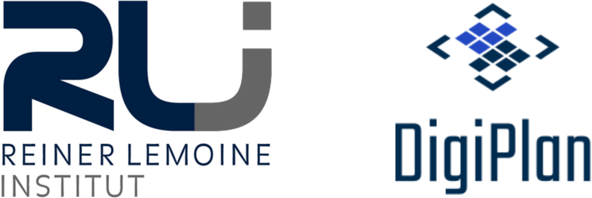

# Willkommen!

{ width="250", align="right"}

Bei *digipipe* handelt es sich um die Datenpipeline zum
[Digitalen Planungsatlas Anhalt](https://digiplan.rl-institut.de), dem
Stakeholder-Empowerment-Tool für die Region Anhalt-Bitterfeld-Wittenberg (ABW).

Die App und die dazugehörige Pipeline wurden vom
[Reiner Lemoine Institut (RLI)](https://reiner-lemoine-institut.de) im Rahmen
des Projekts
[DigiPlan](https://reiner-lemoine-institut.de/digitaler-planungsatlas-anhalt-digiplan/)
in Kooperation mit der
[Energieavantgarde Anhalt](https://www.energieavantgarde.de/) entwickelt.
Die App ist der Nachfolger des
[Stakeholder-Empowerment-Tools StEmp-ABW](https://wam.rl-institut.de/stemp_abw/).

Der Quellcode der App Digiplan ist frei verfügbar. Die benötigten Daten wurden
mit der Daten-Pipeline Digipipe erzeugt, die ebenfalls den Prinzipien von Open
Source & Open Data folgt:

- [Quellcode der Pipeline ("Digipipe")](https://github.com/rl-institut/digipipe)
- [Quellcode der App ("Digiplan")](https://github.com/rl-institut/digiplan)

Dieses Tool und mehr Informationen zu unseren anderen Tools, Karten und Apps zur
Energiewende finden Sie auf dem
[WAM-Portal des RLI](https://wam.rl-institut.de/).
