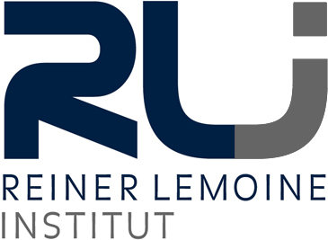

# Willkommen!

{ width="250", align="right"}

Bei *apipe* handelt es sich um eine Datenpipeline des
[Reiner Lemoine Institut (RLI)](https://reiner-lemoine-institut.de)
für WAMs, basierend auf [Digipipe](https://github.com/rl-institut/digipipe).

Mehr Informationen zu unseren anderen Tools, Karten und Apps zur Energiewende
finden Sie auf dem [WAM-Portal des RLI](https://wam.rl-institut.de/).
